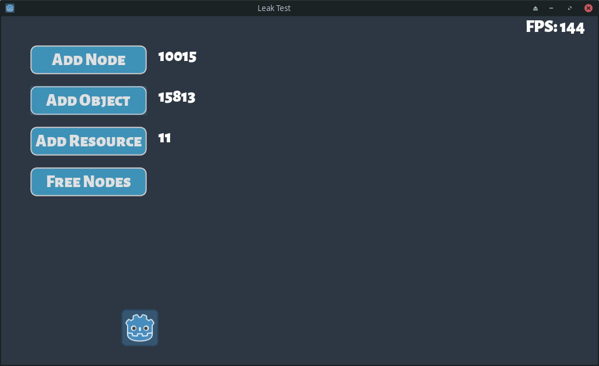

# Memory benchmark for Godot projects

Test different hypotheses about memory leaks (possible leaks)

Also review good practices of dynamic object management

## Reports

[Report link](https://github.com/godotengine/godot/issues/53563)
**Verdict:** it's very sweet to care about all dynamic objects, but when the game closes it will remove nodes, and all orphaned objects do not pose a problem - the OS will clean them.

[Report link](https://godotengine.org/qa/87263/object-wont-queue_free-even-though-its-meeting-requirments)
**Verdict:** interesting, need to review

[Report link](https://github.com/godotengine/godot/issues/32645)
**Verdict:** interesting, adding scene copies, need to review

[Report link](https://godotengine.org/qa/49763/changing-scenes-queue_free-system-memory-eventually-crashes)
**Verdict:** seems like `remove_child` is not required, at least for the object counter, but need to look into the sources of the engine

## Info

Abou running valgrind https://github.com/godotengine/godot/issues/35737